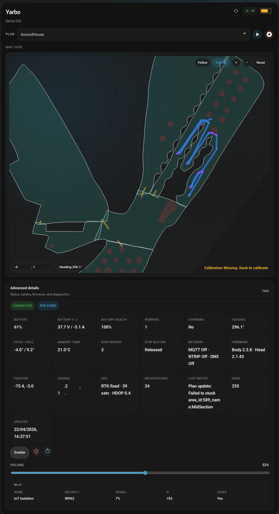

# S2JYarbo Home Assistant

### SORRY BUT THIS LATEST VERSION IS NOW BROKEN. SEEMS THAT THE API HAS CHANGED. FIX IS UNDERWAY ###

Home Assistant custom integration workspace for Yarbo devices using MQTT, published under the `s2jyarbo` domain to avoid conflicts with other Yarbo integrations.

This integration allows a user to view the current map of a YArbo, start and stop plans, Edit and Add No Go Zones and Pathways. More to come. 

This repository contains:

- the `s2jyarbo` custom integration in `custom_components/s2jyarbo`
- a custom S2JYarbo topics sidebar panel
- a custom S2JYarbo overview card for the Home Assistant dashboard

The integration is currently MQTT-first. It subscribes to `snowbot/<serial>/#`, captures topic samples, builds device summaries from `device/DeviceMSG`, `device/heart_beat`, and `device/data_feedback`, and exposes those details through Home Assistant entities and custom UI.

See [CHANGELOG.md](CHANGELOG.md) for feature history.

## Overview snapshot



## Current capabilities

- Config flow with:
  - broker host or IP
  - broker port
  - TLS on or off
  - Yarbo serial number
- Local-push MQTT runtime with automatic reconnect
- Subscription to all device topics under `snowbot/<serial>/#`
- Topic discovery and sample capture in the `S2JYarbo Topics` sidebar panel
- Pairing of `app/get_*` and `app/read_*` commands with `device/data_feedback`
- Merged `device/DeviceMSG` document to capture fields that appear across multiple messages
- Diagnostic sensor entities for MQTT/runtime state
- Device tracker entity from GPS / RTK data
- Overview dashboard card with one widget per selected Yarbo device
- Integrated local map widget inside the overview card with:
  - decoded `get_map` geometry rendering
  - live Yarbo footprint and heading with fixed GPS offset correction
  - dock geometry and docking guard square rendering
  - `plan_feedback` overlay rendering with visited vs remaining plan path state
  - plan summary pill with plan name, progress, remaining area, and estimate
  - `recharge_feedback` return-to-dock route rendering
  - `cloud_points_feedback` collision/barrier rendering
  - follow mode, zoom, pan, and breadcrumb trail controls
  - in-map GPS/heading overlay
  - variable trail width based on mower motor state
  - magenta reverse trail segments
  - edit mode for pathways and no-go zones after a stored Home Assistant acknowledgement
  - pathway/no-go zone point editing, whole-object move, rotate, and no-go zone sizing controls
  - no-go zone preset/context actions for circle, 1 m square, and 1 m 8-point circle generation
  - unsaved-change protection while editing, including Home Assistant dashboard navigation
- Plan dropdown populated from `read_all_plan`
- Start percentage slider under the plan selector
- Device commands from the overview card:
  - start plan
  - pause
  - resume
  - stop
  - recharge
  - shutdown
  - restart
  - volume update
  - bulk refresh
- Auto-refresh of stale device data when `Last Updated` is missing or older than one hour
- Three custom cards to add to your dashboard.

## Project layout

```text
.
├── .github/workflows/          # Validation workflows
├── .homeassistant/              # Local Home Assistant config directory
├── custom_components/
│   └── s2jyarbo/                # S2JYarbo custom integration
├── scripts/                     # Local workflow helpers
├── CHANGELOG.md                 # Project change log
├── LICENSE                      # Distribution license
├── docker-compose.yml           # Local Home Assistant instance
├── hacs.json                    # HACS metadata
├── pyproject.toml               # Ruff configuration
└── requirements-dev.txt         # Optional local tooling
```

## Install in Home Assistant

### HACS

Once this repository is published and available on GitHub, the recommended install path is HACS.

1. Open `HACS -> Integrations`
2. Open the menu and choose `Custom repositories`
3. Add:
   - Repository: `https://github.com/steves2j/Yarbo_HomeAssistant`
   - Category: `Integration`
4. Search for `S2JYarbo Home Assistant Integration`
5. Install it
6. Restart Home Assistant
7. Add the integration from `Settings -> Devices & Services`

### Manual install

1. Copy `custom_components/s2jyarbo` into your Home Assistant config directory under `custom_components/`
2. Restart Home Assistant
3. Add the integration from `Settings -> Devices & Services`

Example target path:

```text
<config>/
└── custom_components/
    └── s2jyarbo/
```

## Release and distribution notes

The repository now includes the minimum scaffolding for a normal HACS-style custom integration release:

- `hacs.json`
- `LICENSE`
- GitHub workflow for HACS validation
- GitHub workflow for `hassfest`

For a clean public release:

1. Push the repository to GitHub
2. Make sure the repository description, topics, and branding are set appropriately on GitHub
3. Bump `custom_components/s2jyarbo/manifest.json` `version`
4. Update `CHANGELOG.md`
5. Create a GitHub release/tag that matches the integration version
6. Verify the GitHub Actions pass

If the GitHub repository URL changes, update:

- `custom_components/s2jyarbo/manifest.json`
- this README

## Home Assistant UI

### Devices & Services

Each config entry creates:

- `sensor.<name>_mqtt_connection`
- `sensor.<name>_discovered_mqtt_topics`
- `device_tracker.<name>_location`

The integration can be reconfigured from the S2JYarbo card menu in `Settings -> Devices & Services`.

### S2JYarbo Topics sidebar

The custom admin-only sidebar panel is registered as `S2JYarbo Topics`.

It shows:

- discovered topics
- latest sample per topic
- command/response pairing for `app/get_*` and `app/read_*`
- packet metadata
- merged `DeviceMSG` document

### S2JYarbo dashboard cards

The frontend registers three separate Lovelace cards:

- `custom:s2jyarbo-control-card`
- `custom:s2jyarbo-map-card`
- `custom:s2jyarbo-advanced-card`

Recommended:
- add the three cards to a normal Lovelace dashboard
- configure each card for the same S2JYarbo device when you want a complete dashboard view

If you are using Home Assistant `2026.4` or newer, be aware that new installs use the new auto-generated Home/Overview dashboard by default. That view only exposes `Add entity` and does not behave like a normal Lovelace dashboard for custom cards.

In that case, the working path is:

1. Open `Settings -> Dashboards`
2. Click `Add dashboard`
3. Create a new dashboard
4. Open that dashboard
5. Click `Edit dashboard`
6. Click `Add card`
7. Add the S2JYarbo custom cards you want

If you prefer, you can also create a dashboard from the `Overview (legacy)` template and add the card there.

Example Lovelace setup:

```yaml
type: custom:s2jyarbo-control-card
---
type: custom:s2jyarbo-map-card
---
type: custom:s2jyarbo-advanced-card
```

The control card includes:

- connection state
- serial number
- battery and recharge action
- Wi-Fi signal strength
- satellite count
- plan selection
- start percentage slider
- start / pause / resume / stop controls

The map card includes:

- decoded site geometry from `get_map`
- follow mode, zoom, pan, reset, breadcrumbs, and live device heading
- fixed GPS offset correction applied to the live Yarbo position
- trail width changes between transit and 550 mm cutting width based on mower motor state
- magenta trail segments for reverse movement
- `plan_feedback` overlays:
  - visited vs remaining plan path rendering
  - right-side plan summary pill
- `recharge_feedback` as a cyan dotted return-to-dock route
- `cloud_points_feedback` as tomato collision/barrier strips
- pathway, memory path, and no-go zone edit mode:
  - full-browser warning acknowledgement stored in Home Assistant
  - point insert, drag, and delete
  - Ctrl-drag whole-object move
  - Shift-scroll rotate
  - Ctrl-scroll no-go zone resize
  - no-go zone context menu actions for `ToCircle`, `addSquare`, and `addCircle`
  - unsaved-change prompts with discard, cancel, and save flows
- background aerial image support:
  - upload a background image
  - Shift-drag to move the image
  - scroll to scale the image
  - Ctrl-scroll to rotate the image around the cursor
  - opacity control
  - placement import/export JSON for backup/restore across Home Assistant instances

The advanced card includes:

- status, battery, firmware, GPS, network, and diagnostic details
- shutdown and restart controls
- volume control
- Wi-Fi details

## MQTT behavior

The integration currently expects:

- requests on `snowbot/<serial>/app/...`
- live state from:
  - `device/DeviceMSG`
  - `device/heart_beat`
  - `device/data_feedback`

Notes:

- `device/DeviceMSG` payloads may be zlib-compressed JSON
- `device/data_feedback` is paired back to the originating command topic, preferably using the `topic` field inside the payload
- some brokers do not echo outbound `app/*` publishes back to subscribers; the integration does not rely on that echo for core device state updates

## Development notes

- Code changes in `custom_components/s2jyarbo` are mounted directly into the local Home Assistant container.
- Frontend changes usually require a hard browser refresh.
- Backend changes usually require reloading the integration or restarting Home Assistant.
- The custom panel/frontend bundle is served from `custom_components/s2jyarbo/panel/`.

## Known limitations

- This is still a custom integration under active development, not a finished package.
- Some Yarbo MQTT payloads and command shapes are being derived from observed traffic and cached samples.
- Native HA recorder may warn when topic/entity attributes become very large.

## Reference docs

- Home Assistant development environment:
  - https://developers.home-assistant.io/docs/development_environment/
- Home Assistant config flows:
  - https://developers.home-assistant.io/docs/core/integration/config_flow/
- Home Assistant custom integration branding:
  - https://developers.home-assistant.io/docs/core/integration/brand_images
- Home Assistant frontend icons:
  - https://www.home-assistant.io/docs/frontend/icons/

## AI acknowledgement

There is no pretence. Most of this code was developed using AI. AI is a tool, not a replacement for a developer, and it handles a lot of the boring boilerplate work. It still makes enough mistakes that a human developer is required, as it is not yet at a stage where it can write unsupervised code reliably. Do not hate AI; see it as a tool, the next generation of autocomplete. Autocomplete with benefits.
